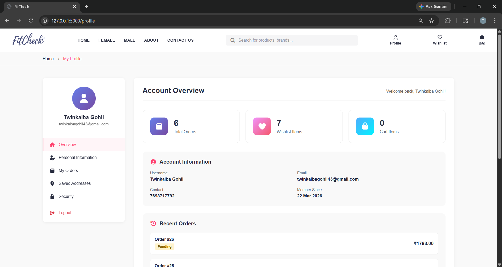

# 🔥 FitCheck – Features

---

## 👤 User Features

### 🔐 User Authentication
- Secure registration & login system  
- Password hashing using Werkzeug  

### 📧 OTP-Based Password Reset
- Email OTP verification  
- Secure session-based validation  

### 👤 User Profile Management
- Update personal details (address, city, state, etc.)  
- Change password functionality
  

### 🛍️ Product Browsing
- View all products with categories & subcategories  
- Search by product name, brand, or category  

### ❤️ Wishlist System
- Add/remove products to wishlist  
- View all saved items  

### 🛒 Shopping Cart
- Add, update, remove items  
- Dynamic quantity handling  

### 💳 Checkout System
- Place orders with shipping & pricing calculation  

### 📦 Order Management
- View order history  
- Track order status (pending, shipped, delivered, cancelled)  
- Cancel orders (if pending)  

### 🧾 Invoice Generation
- View invoice in browser  
- Download invoice as PDF  

### ⭐ Product Reviews & Ratings
- Write, edit, delete reviews  
- Only verified buyers can review  
- View all reviews with ratings  

### 📩 Contact System
- Send messages via contact form (email integration)  

---

## 🛠️ Admin Features

### 🔐 Admin Authentication
- Secure admin login system  

### 📊 Dashboard Analytics
- View total users, products, orders  
- Revenue calculation  
- Date-based filtering (1, 7, 30, 90 days, all-time)  

### 📦 Product Management
- Add new products  
- Edit product details  
- Upload multiple images  
- Replace/delete images  
- Delete products  

### 🗂️ Category & Subcategory Management
- Add, edit, delete categories  
- Add, edit, delete subcategories  

### 👥 Customer Management
- View all registered users  

### 📦 Order Management
- View all orders  
- Update order status (pending → delivered)  
- Update payment status  

### 💳 Payment Handling
- Track payment status (pending, completed, failed)  

### ⭐ Review Management
- View all product reviews  
- Filter by rating  
- Delete inappropriate reviews  

---

## ⚙️ System Features

### ⚡ Full-Stack Architecture
- Backend: Flask (Python)  
- Database: SQLAlchemy ORM  

### 🗄️ Database Models
- User, Product, Category, Order, Payment, Cart, Wishlist, Feedback  

### 📂 Image Upload System
- Secure file handling using `secure_filename`  

### 🔄 AJAX-Based APIs
- Cart, Wishlist, Orders, Reviews (dynamic updates)  

### 🔐 Session Management
- Secure login sessions  

### 📱 Responsive UI
- Works across devices  

### 🧩 Modular Code Structure
- Blueprints (admin & user separation)  

---

## 🚀 Advanced Features (Interview Highlights 💯)

- OTP Email System using SMTP  
- Dynamic dashboard analytics with date filters  
- Multi-image product management (replace + delete + add)  
- PDF invoice generation using `xhtml2pdf`  
- Role-based authentication (Admin/User)  
- Review system with purchase validation  

---
